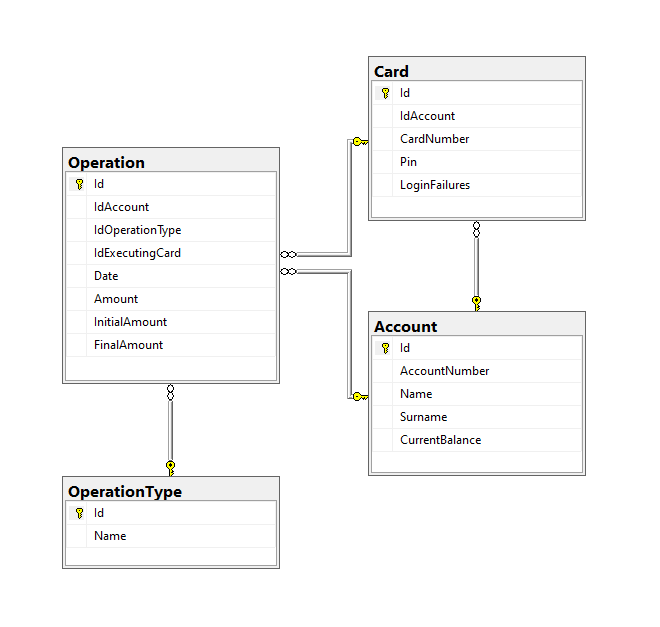

# Proyecto Metafar 

Diagrama



Este proyecto utiliza una base de datos SQL Server contenida en un contenedor Docker. 
A continuación se presentan los pasos necesarios para ejecutar la base de datos, las credenciales de conexión y datos de prueba.

## Requisitos

- Docker instalado en tu máquina local.
- Puerto 1433 disponible en tu máquina.

## Comandos para ejecutar la base de datos en Docker

1. **Descargar la imagen de Docker**:
   Ejecuta el siguiente comando en la terminal para descargar la imagen del SQL Server:

```
 docker pull jpguerci/sqlservermetafar:1.0
 docker run --rm -it -p 1433:1433 jpguerci/sqlservermetafar:1.0
```
2. **Datos de conexion a la db**:
 ```
 port:1433
 username:sa
 password: metafar_ChallengeAPI
```
 3.**Datos de prueba**:

Tarjeta1:
```
 {
  "cardNumber": 987654,
  "pin": 1111
 }
```
Tarjeta2:  
```
{
  "cardNumber": 654564,
  "pin": 2222
}
```
